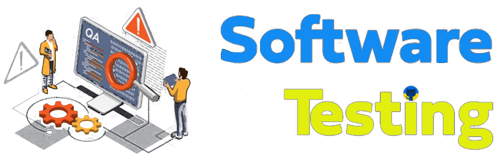

  

# Hi! My name is Denis.

---
### About me:

I am a tester with banking experience. I have a great desire to work as a Manual Quality Assurance Engineer. I hold a Master’s degree in Computer Systems, possess solid theoretical knowledge in Quality Assurance, and have practical experience in testing websites. Also, I have 5 years of experience completing technical tasks and performing acceptance testing. I am a fast learner, attentive to detail, with critical and logical thinking skills, as well as teamwork abilities. I am motivated to grow professionally and am ready to acquire knowledge and practical skills in automated testing in the future. I read books about Python. I have been learning Pytest, Playwright, Selenium, SQL, and API in Python. 

My portfolio can be found [here](https://github.com/Cheglikov/Portfolio.git).

---

### You can contact me: 

---

### Skills and Tools:

 

---

  
  
  

---

          
 

          
          
          
         

